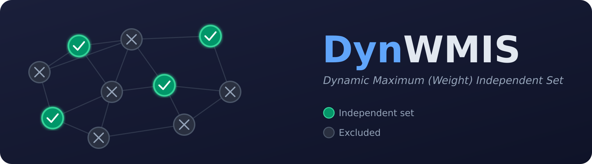

# DynWMIS &mdash; Dynamic Maximum (Weight) Independent Set

[](https://opensource.org/licenses/MIT)
[](https://en.cppreference.com/w/cpp/17)
[](https://cmake.org/)
[](https://github.com/DynGraphLab/DynWMIS)
[](https://github.com/DynGraphLab/DynWMIS)
[](https://github.com/DynGraphLab/homebrew-dyngraphlab)
[](https://github.com/DynGraphLab/DynWMIS/stargazers)
[](https://github.com/DynGraphLab/DynWMIS/issues)
[](https://github.com/DynGraphLab/DynWMIS/commits)
[](https://arxiv.org/abs/2407.06912)
[](https://www.uni-heidelberg.de)

<p align="center">
  
</p>

Part of the [DynGraphLab &mdash; Dynamic Graph Algorithms](https://github.com/DynGraphLab) open source framework. Developed at the [Algorithm Engineering Group, Heidelberg University](https://ae.ifi.uni-heidelberg.de).

## Description

A fully dynamic algorithm for the NP-complete maximum weight and maximum cardinality independent set problem. We introduce *optimal neighborhood exploration*, a novel local search technique that creates independent subproblems solved to optimality, leading to improved overall solutions. Applications include dynamic map labeling and vehicle routing.

The algorithm features a parameter (subproblem size) that balances running time and solution quality.

## Install via Homebrew

```console
brew install DynGraphLab/dyngraphlab/dynwmis
```

Then run:
```console
dynwmis FILE --algorithm=DynamicOneFast
```

## Installation (from source)

```console
git clone https://github.com/DynGraphLab/DynWMIS
cd DynWMIS
./compile_withcmake.sh
```

All binaries are placed in `./deploy/`. Alternatively, use the standard CMake process:

```console
mkdir build && cd build
cmake ../ -DCMAKE_BUILD_TYPE=Release
make && cd ..
```

## Usage

```console
dynwmis FILE [options]
```

### Examples

```console
./deploy/dynwmis examples/4elt.graph.seq --algorithm=DynamicOneFast
./deploy/dynwmis examples/4elt.graph.seq --algorithm=DynamicOneStrong
```

### Converting METIS graphs

To convert a METIS graph file into the dynamic sequence format:

```console
./deploy/dynwmis_convert_metis_seq nameofgraphfile.graph
```

## Input Format

Edge list format. The first line starts with `# n m [weighted]` where `n` is the number of nodes, `m` is the number of updates, and an optional `1` indicates a weighted graph. For weighted graphs, the next `n` lines specify vertex weights. Updates follow: `1 u v` for edge insertion, `0 u v` for edge deletion. Vertex IDs start at 1.

```
# 100 500
1 1 2
1 3 4
0 1 2
```

For weighted graphs:
```
# 100 500 1
10
20
...
1 1 2
```

## License

The program is licensed under the [MIT License](https://opensource.org/licenses/MIT).
If you publish results using our algorithms, please acknowledge our work by citing the following paper:

```bibtex
@inproceedings{DBLP:conf/alenex/BorowitzG025,
  author       = {Jannick Borowitz and
                  Ernestine Gro{\ss}mann and
                  Christian Schulz},
  title        = {Optimal Neighborhood Exploration for Dynamic Independent Sets},
  booktitle    = {27th Symposium on Algorithm Engineering and Experiments, {ALENEX} 2025},
  pages        = {1--14},
  publisher    = {{SIAM}},
  year         = {2025},
  doi          = {10.1137/1.9781611978339.1}
}
```
